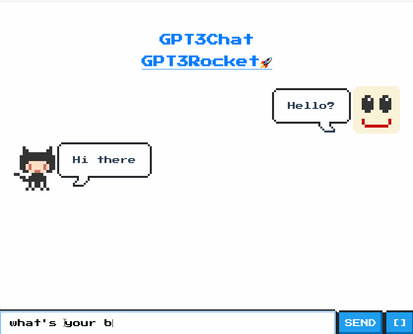
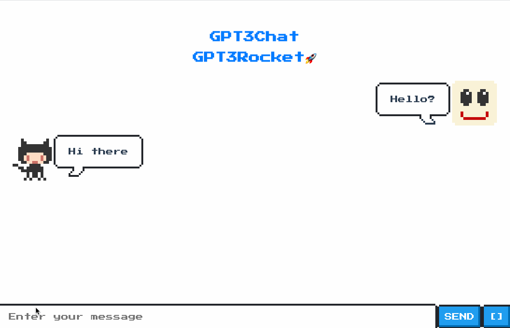

## GPT3-Chat

---

**Note:** For the very impatient, go here: **[quickstart](./quickstart.md)** or **[jump to personas](#"persona")**

---

## What is this?

This is an experimental toy chat interface for conversational characters or "personas" using GPT3. You can swap between these conversational "personas" on the fly & adjust an individual persona's creativity/randomness level and add samples. You can also import/export personas from an external JSON file-- **[following this format](#Format)**

The big idea is to make it very fast to adjust/switch:

- **"Priming statements"**: Natural language description of the task to be performed (or the background/mood of a conversational agent)

- **Samples:** GPT3 does not need a lot of input/output pairs, but a few clues/examples can help guide it to productively complete a query

## "Persona"

For the purposes of this exploratory tool, a "persona" (configurable in **[src/personas.js](./src/personas.js))** is a collection of samples + a priming statement. Maybe it's a bit like giving the agent a different "attitude" or world of knowledge.



Once you load in a persona, some of these questions have generated some fascinating "emergent" completions:

| Query                            |
| -------------------------------- |
| How should I live my life?       |
| How do I be more brave like you? |
| What is your mission?            |

## Config/Tinkering

There are lots of ways to edit your persona- see the **[resources doc](./docs/resources.md)** for a rundown of API config options



## Inspiration

- On priming statements & providing samples, **[Shreya Shankar's explorations about priming](https://twitter.com/sh_reya/status/1284545996882468864)** & **[Nick Cammarata's remarks](https://twitter.com/nicklovescode/status/1284050958977130497)** were especially helpful.

- Also Shankar's **[GPT3-sandbox](https://github.com/shreyashankar/gpt3-sandbox)**

- GPT3 paper: "...the model is conditioned on **a natural language instruction** [*priming statement*]) and/or a few demonstrations of the task [*samples*] and is then expected to complete further instances of the task simply by predicting what comes next"

## Libraries & credits

- NES.CSS: https://github.com/nostalgic-css/NES.css

- Press Start 2P font: https://fonts.google.com/specimen/Press+Start+2P

- Carol Skelly's zero-dependency JSON linter: https://medium.com/wdstack/vue-json-lint-4d665671e993

## Building

For bundled builds, to "set" the backend modify the file **[.env.production](.env.production)**

For development, see the file **[.env](.env)**

## Format

- Samples: `[['input sample1', 'output sample1'], ['input sample2', 'input sample2']]`

- # APIFlags: See **[here](./docs/resources.md#APIFlags)**

```js
{
	"adlai": {
		"samples": [
			["Why is there a hole in your shoe?", "Well, it's better to have a hole in your shoe than a hole in your head!"],
			["How are things going generally?", "The human race has improved everything but the human race"],
			["Do you have any tips about people?", "You can tell the size of a man by the size of the thing that makes him mad"],
			["What's the difference between a politician and a statesman?", "A politician is a statesman who approaches every question with an open mouth"]
		],
		"prefix": "This is a conversation with Adlai Stevenson. Adlai Ewing Stevenson II was an American lawyer, politician, and diplomat. Raised in Bloomington, Illinois, Stevenson was a member of the Democratic Party.[1] He served in numerous positions in the federal government during the 1930s and 1940s, including the Agricultural Adjustment Administration, Federal Alcohol Administration, Department of the Navy, and the State Department. In 1945, he served on the committee that created the United Nations, and he was a member of the initial U.S. delegations to the UN. He was the 31st governor of Illinois from 1949 to 1953, and he won the Democratic Party's nomination for president in the 1952 and 1956 elections. In both the 1952 and 1956 elections, Stevenson was defeated in landslides by Republican Dwight D. Eisenhower. He unsuccessfully sought the Democratic presidential nomination for a third time at the 1960 Democratic National Convention. After President John F. Kennedy's election, he appointed Stevenson as the United States Ambassador to the United Nations.",
		"meta": {
			"name": "Adlai",
			"description": 'Adlai Stevenson is a witty diplomat, lawyer, politician, twice-failed Presidential candidate,
		},
		"APIFlags": {
			"temperature": 0.6
		}
	}
}
```

## Project setup

```

npm install

```

### Compiles and hot-reloads for development

```

npm run serve

```

### Compiles and minifies for production in dist/

This build a "static" (no live reload) version of your frontend available on http://localhost:8000/

```
npm run build
npm run server
```
